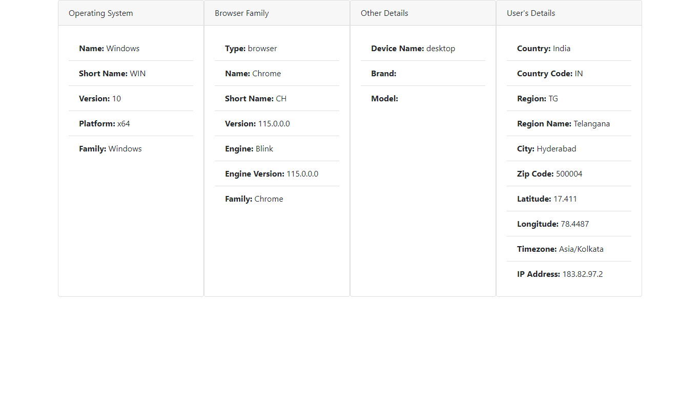

# Know Your End User by browser monitoring

`See how library that parses User Agents and Browser Client Hints to detect devices (desktop, tablet, mobile, tv, cars, console, etc.), clients (browsers, feed readers, media players, PIMs, ...), operating systems, brands and models. 
With browser and mobile real user monitoring (RUM), optimize customer journeys across devices, operating systems and browser types like never before to drive business results.`

  

